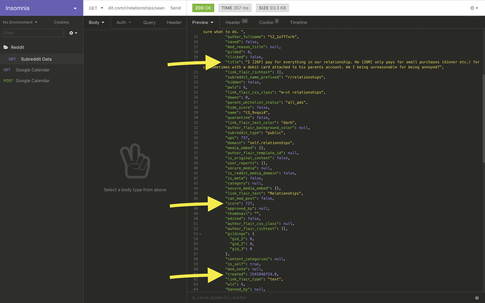

# Reddit Ultimate Karma Farm

It's time to farm karma in a way that's never been done before!\
....probably.\
Wireframes:
  1. https://wireframe.cc/UXIN66
  2. https://wireframe.cc/VjUXWI
## User Stories
The user will navigate to the RUKF and enter a subreddit in the search bar.\
When the user selects the subreddit, the view is populated with the ten most successful posts in that subreddit this month.\
Below that, the user is shown the best time of day for a successful subreddit post, based on a bell curve of the top posts.\
The user will then have the option of making a Google Calendar event to remind her to post for maximum karma.

## MVP
1. The user selects a subreddit and is given an error if that subreddit doesn't exist
2. The user is provided with the top ten posts of that subreddit this month
3. The user is provided with the opportune time of day to post on that subreddit

## Future Implementations
1. Of the top ten posts, users are shown if those posts have been gilded and how many comments it has
2. Using OAuth, the user can populate her Google Calendar with an event, showing:
    1. The time the post should be submitted
    2. The content of the post, provided by the user at time of event creation
3. Using Oauth, the user can login with her Reddit credentials, and post the content directly from the app

## Required APIs and Data
For MVP, the app will need to utilize Reddit's open Source API and will not require OAuth.\
Required data from a GET request to this API will include:
  1. score
  2. created_utc
  3. gilded
  4. id
  5. over_18
  6. permalink
  7. title
  8. url\
All of these data are provided by the Reddit API and have been successfully retrieved via testing.\

Weekly Plan:
Wed: Render best time to post on specific Subreddit
     Minimal Styling for MVP
Thurs: OAuth logging with Reddit credentials
Fri: Stage posts for automatic posting
Sat: styling
Sun: refactor and clean up
